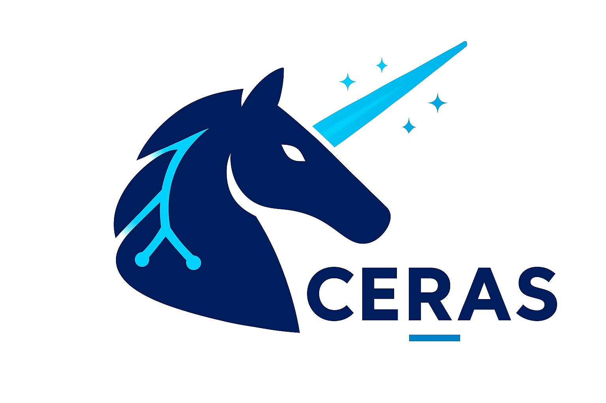

<!--# CERAS
<!---Curiosity Engine for Research in Artificial Systems-->

## Overview
Are you tired of all the academic gatekeeping when it comes to AI and ML? Do you blindly copy and paste whatever the LLM spits out when using TensorFlow or PyTorch without knowing what the heck is going on? Me too. So while I could write some stuff with all those fancy Python frameworks and libraries, where is the fun in that? The best way to learn is to do something yourself, so why not just try to recreate (I mean, not a full recreation, just some of the main concepts) all those frameworks from first principles to at least get an idea of how they work? In case that is too easy, let's write it all in C because nobody uses that old crusty language today, we are all supposed to use Rust and Zig because of memory safety or something. This project is not meant to replace all those over-engineered and complicated frameworks, as those are well-vetted, highly adopted, and written by people who actually know what they are doing. So let's boldly (and more often than not moronically) go where many have already gone before.

